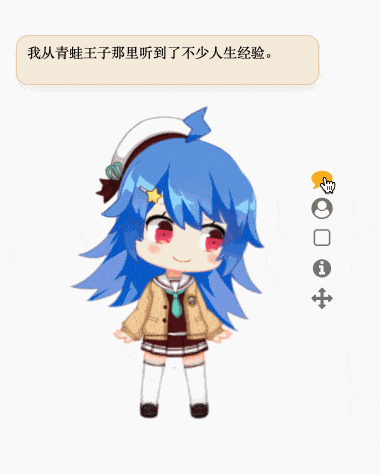

> 给你的桌面多一点趣味~😁

**支持 Live2d v3 啦~**


## 预览


小工具：




设置（可以使用在线/本地 Model）：


## 功能

- [x] 支持 Live2d v2/v3
- [x] 导入本地/在线 Model 
- [x] 调整渲染大小
- [x] 置顶
- [x] 忽略点击
- [x] 开机启动
- [x] 拖动位置
- [ ] AI

## 安装


（可以使用 [GitHub Proxy 代理加速](https://mirror.ghproxy.com/) 下载）

## 使用
### 导入模型

两种方式：

- 在设置 -> 模型列表中添加 `json` 文件（本地模型以`file://`开头）。

- 本地模型将文件夹拖入窗口中，导入成功会更新到模型列表中


## Develop

```sh
ELECTRON_MIRROR="https://npmmirror.com/mirrors/electron/"
ELECTRON_CUSTOM_DIR="{{ version }}"

npm install --verbose
npm start
```

## 欢迎参与贡献

发现了错误? 向我发起一个 PR 吧! 参考 [Commit message 和 Change log 编写指南 - 阮一峰的网络日志](http://www.ruanyifeng.com/blog/2016/01/commit_message_change_log.html) 提交 commit 即可。
## 其他

Model资源： [yoyofx/live2d-model-assets](https://github.com/yoyofx/live2d-model-assets)


